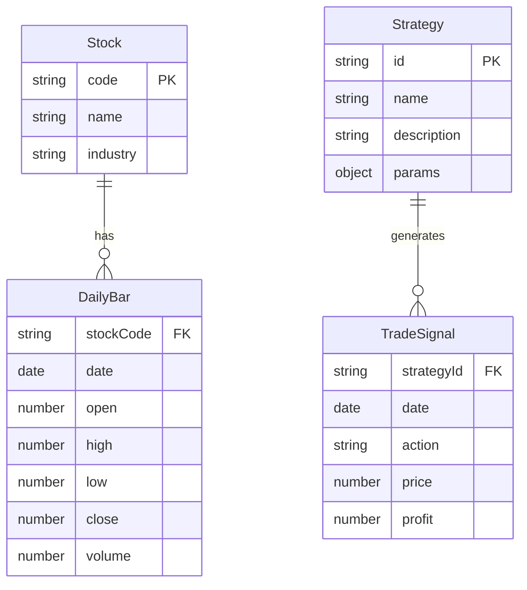

## 1. 架构设计

```mermaid
flowchart LR
    subgraph "前端层"
        "React SPA" --> "状态管理 Zustand"
        "React SPA" --> "K线图表 ECharts"
        "React SPA" --> "路由 React Router"
    end
    subgraph "数据层"
        "模拟数据生成器" --> "技术指标计算引擎"
        "技术指标计算引擎" --> "量化策略引擎"
        "量化策略引擎" --> "预测信号生成器"
    end
    subgraph "外部服务"
        "无需外部API"
    end
    "前端层" --> "数据层"
```

## 2. 技术说明
- 前端：React@18 + TypeScript + TailwindCSS@3 + Vite
- 初始化工具：Vite
- 后端：无（纯前端应用）
- 数据库：无（使用内存模拟数据）
- 图表库：ECharts@5（K线图及技术指标渲染）
- 状态管理：Zustand（轻量级状态管理）
- 路由：React Router v6

## 3. 路由定义
| 路由 | 用途 |
|------|------|
| / | 行情分析页（默认首页），股票搜索、K线图、技术指标、预测信号 |
| /quant | 量化模拟页，策略选择、回测结果、交易记录、操作建议 |

## 4. 核心模块设计

### 4.1 模拟数据生成器
- 根据股票代码生成240个交易日（约一年）的OHLCV数据
- 基于几何布朗运动模型模拟股价走势，加入A股特征的涨跌停限制（±10%）
- 预设50只热门A股代码与名称映射

### 4.2 技术指标计算引擎
- MA（5/10/20/60日均线）
- MACD（12/26/9参数）
- KDJ（9/3/3参数）
- 布林带（20日中轨，2倍标准差）
- RSI（14日）
- 成交量均线

### 4.3 量化策略引擎
- 均线交叉策略：MA5上穿MA20买入，下穿卖出
- MACD金叉策略：DIF上穿DEA买入，下穿卖出
- 布林带突破策略：价格触及下轨买入，触及上轨卖出
- KDJ超买超卖策略：K<20买入，K>80卖出
- 多因子组合策略：综合以上信号加权评分

### 4.4 预测信号生成器
- 汇总各指标当前状态
- 加权计算综合评分（0-100）
- 评分>60看涨，<40看跌，40-60震荡
- 输出置信度百分比
- 计算支撑位/压力位/止损位/止盈位

## 5. 数据模型

### 5.1 数据模型定义



### 5.2 TypeScript 类型定义

```typescript
interface Stock {
  code: string;
  name: string;
  industry: string;
}

interface DailyBar {
  stockCode: string;
  date: string; // YYYY-MM-DD
  open: number;
  high: number;
  low: number;
  close: number;
  volume: number;
}

interface TradeSignal {
  date: string;
  action: 'buy' | 'sell';
  price: number;
  profit?: number;
}

interface PredictionResult {
  signal: 'bullish' | 'bearish' | 'neutral';
  confidence: number; // 0-100
  supportPrice: number;
  resistancePrice: number;
  stopLossPrice: number;
  takeProfitPrice: number;
}

interface BacktestResult {
  annualReturn: number;
  maxDrawdown: number;
  sharpeRatio: number;
  winRate: number;
  totalTrades: number;
  profitCurve: { date: string; value: number }[];
  signals: TradeSignal[];
}
```
